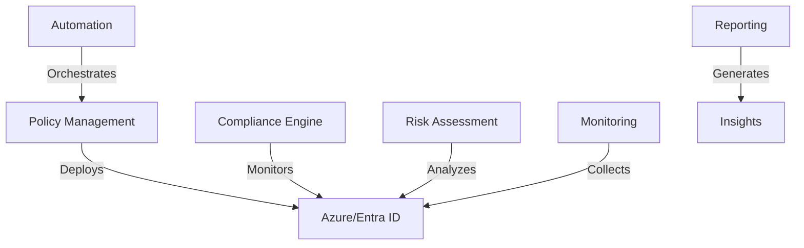

# Azure Conditional Access Automation Framework


[](https://opensource.org/licenses/MIT)
[](https://github.com/PowerShell/PowerShell)
[](https://azure.microsoft.com/services/active-directory/)

Enterprise-grade automation framework for managing Azure/Entra ID Conditional Access policies at scale. Built from real-world experience managing complex security requirements in mid-to-large organizations.

## 🚀 Features

- **Policy Lifecycle Management**
  - Automated policy deployment and updates
  - Conflict detection and resolution
  - Designed for integration with version control systems (e.g., Git) for policy-as-code lifecycle management.

- **Compliance & Risk Management**
  - Built-in compliance frameworks (ISO 27001, NIST 800-53, GDPR)
  - Real-time risk assessment
  - Automated compliance reporting

- **Monitoring & Reporting**
  - Advanced policy effectiveness metrics using the `PolicyMonitor` class (see `src/modules/reporting/PolicyMonitor.ps1`).
    - The `GenerateMetricsReport` method can output a detailed metrics hashtable.
    - Optionally, use the `-SendToLogAnalytics` switch with `GenerateMetricsReport` to send summary data to the `PolicySummaryMetrics_CL` custom table in Log Analytics, enabling trend analysis and workbook integration.
  - User impact analysis.
  - Custom Azure Monitor workbooks (see "Conditional Access Insights Workbook" section below).

- **Security & Governance**
  - Just-In-Time privileged access
  - Comprehensive audit logging
  - Role-based access control

## 📋 Prerequisites

- PowerShell 7.2 or higher
- Azure/Entra ID Premium P2 license
- Required Azure AD permissions:
  - Policy.ReadWrite.ConditionalAccess
  - Policy.Read.All
  - Directory.Read.All
  - AuditLog.Read.All

## 🛠️ Installation

1. Clone the repository:
```bash
git clone https://github.com/yourusername/ca-automation.git
cd ca-automation
```

2. Install required PowerShell modules:
```powershell
./scripts/setup/Install-ProjectDependencies.ps1
```

3. Configure your environment:
```powershell
Copy-Item .env.example .env
# Edit .env with your environment settings (ensure .env is in .gitignore)
```

## 🚦 Quick Start

1. **Basic Policy Deployment**
```powershell
Import-Module ./src/modules/policy-management/PolicyManager.ps1

$policyManager = [ConditionalAccessPolicyManager]::new($TenantId)
$policyManager.DeployPolicy("./templates/policies/security-baseline.yaml")
```

2. **Compliance Assessment**
```powershell
Import-Module ./src/modules/compliance/ComplianceManager.ps1 # Ensure module is imported

$complianceManager = [ComplianceManager]::new($TenantId)
# For custom frameworks: $customFrameworks = @{...}; $complianceManager = [ComplianceManager]::new($TenantId, $customFrameworks)

$reportFramework = "ISO27001"
$reportOutputPath = "./reports/compliance-$reportFramework-$(Get-Date -Format 'yyyyMMdd').csv"
$complianceManager.GenerateComplianceReport($reportFramework, $reportOutputPath)
Write-Host "Compliance report generated at $reportOutputPath"
```

3. **Risk Analysis**
```powershell
Import-Module ./src/modules/risk/RiskAssessor.ps1 # Ensure module is imported
Import-Module ./src/modules/policy-management/PolicyManager.ps1 # To get policies

$policyMgr = [ConditionalAccessPolicyManager]::new($TenantId)
# Get-MgIdentityConditionalAccessPolicy requires Graph connection, PolicyManager handles this.
# Retrieve actual policy objects for analysis.
$allCaPolicies = Get-MgIdentityConditionalAccessPolicy -All # Assuming connection is established.
                                                                # Or use $policyMgr.GetPolicyMap().Values if only basic properties are needed by RiskAssessor.
                                                                # For GenerateRiskReport, full policy objects are better.

$riskAssessor = [RiskAssessor]::new()
# For custom risk model: $customFactors = @{...}; $customWeights = @{...}; $riskAssessor = [RiskAssessor]::new($customFactors, $customWeights)

$riskReportData = $riskAssessor.GenerateRiskReport($allCaPolicies) # GenerateRiskReport expects an array of policy objects

# Example: Exporting the risk report data to JSON
$riskReportPath = "./reports/risk-assessment-$(Get-Date -Format 'yyyyMMdd').json"
$riskReportData | ConvertTo-Json -Depth 5 | Out-File -Path $riskReportPath
Write-Host "Risk assessment report (JSON) generated at $riskReportPath"
```

## 📊 Conditional Access Insights Workbook

An Azure Monitor Workbook template is available to provide rich visualizations and insights into your Conditional Access policy environment. This workbook helps you understand policy effectiveness, impact on sign-ins, user and sign-in risk, and generated alerts based on policy behavior.

**Location of Template:**
The workbook JSON template can be found in the repository at:
`src/modules/reporting/dashboards/policy-monitoring-workbook.json`

**Key Sections & Insights:**
The workbook is structured to provide insights into several key areas:
-   **Policy Effectiveness Overview:** KPIs and trends related to overall sign-in success, failures, and MFA challenges.
-   **Policy Impact Analysis:** Detailed breakdown of how individual policies are applied, including counts of applied policies, blocked access, and MFA requirements per policy.
-   **Risk Analysis:** Visualization of risky sign-ins (based on `AADRiskyUsers` and `SigninLogs`), including trends by risk level and the percentage of risky sign-ins that were blocked.
-   **Generated Alerts:** A table of potential alerts based on configurable KQL queries, such as high sign-in failure rates.

**Prerequisites for Data:**
For the workbook to populate correctly, you must have the following Azure AD data sources configured to send data to the Log Analytics Workspace that the workbook will be pointed to:
-   **`SigninLogs`**: Essential for most policy effectiveness, impact, and MFA challenge metrics.
-   **`AADRiskyUsers`**: Required for the Risk Analysis section to show data related to user risk events. (Note: Ensure Identity Protection is enabled and configured to populate this table.)
-   **`PolicySummaryMetrics_CL` (Custom Log)**: This table is populated by the `PolicyMonitor.GenerateMetricsReport` method when used with the `-SendToLogAnalytics` switch. It stores periodic summary metrics and recommendations.

### PolicySummaryMetrics_CL Custom Log Table

This custom table stores periodic summary metrics generated by the `PolicyMonitor.GenerateMetricsReport` method when the `-SendToLogAnalytics` switch is used. It's designed to allow these summary KPIs and recommendations to be visualized in Azure Monitor Workbooks or queried directly.

**Key Columns:**
*   `EventTime_t` (DateTime): Timestamp when the report was generated and data was ingested.
*   `TenantId_g` (Guid): Azure AD Tenant ID from which the report was generated.
*   `TotalPolicies_d` (Number): Total count of Conditional Access policies in the tenant at the time of report generation.
*   `ActivePolicies_d` (Number): Count of 'enabled' Conditional Access policies.
*   `UniqueBlockedUserCount_d` (Number): Count of unique users that were blocked by a Conditional Access policy during the report's time range.
*   `ReportTimeRangeStart_t` (DateTime): The start of the time range covered by the summarized metrics in this log entry.
*   `ReportTimeRangeEnd_t` (DateTime): The end of the time range covered by the summarized metrics in this log entry.
*   `Recommendations_s` (String): A JSON string array containing textual recommendations based on the metrics report.
*   `SourceScript_s` (String): Identifier of the data source, typically "PolicyMonitor.ps1/GenerateMetricsReport".

**Deployment Instructions:**
To deploy and use this workbook in your Azure environment:
1.  Navigate to your **Azure portal**.
2.  Go to **Azure Monitor** > **Workbooks**.
3.  Click **+ Create** or select **Empty** to start a new workbook.
4.  Click the **Advanced Editor** button (it usually has an icon like `</>`).
5.  Open the `src/modules/reporting/dashboards/policy-monitoring-workbook.json` file from this repository.
6.  Copy the **entire JSON content** from this file.
7.  Paste the copied JSON into the Advanced Editor in Azure Monitor Workbooks, replacing any existing content.
8.  Click **Apply**.
9.  The workbook should load. You will likely need to select the appropriate **Subscription**, **Resource Group**, and **Log Analytics Workspace** that contains your Azure AD diagnostic data (`SigninLogs`, `AADRiskyUsers`). These are often configured at the top of the workbook or when it first loads if no defaults are set.
10. **Save** the workbook. Give it a descriptive name like "Conditional Access Insights Dashboard" or "Policy Monitoring Workbook". Choose a region and resource group to save the workbook resource itself.

Once saved, you can access and share this workbook with relevant stakeholders. Remember to periodically check for updates to the template in this repository.

## 📊 Sample Dashboard

**Dashboard Status:** Azure Monitor Workbook KQL queries are available in `src/modules/reporting/dashboards/policy-monitoring.kql`. The full visual dashboard/GUI is a planned feature (see `docs/ROADMAP.md`).

The built-in monitoring dashboard provides real-time visibility into:
- Policy effectiveness metrics
- User impact analysis
- Compliance status
- Risk indicators

## 🏗️ Architecture



## 🔒 Security Considerations

- All deployments require approved pull requests
- Changes are validated against security baselines
- Automated conflict detection prevents policy overlap
- Just-In-Time access for privileged operations
- Comprehensive audit logging
- For more details, see [Security Considerations](docs/security/README.md).

## 📖 Documentation

Detailed documentation is available in the [docs](./docs) directory:
- [Architecture Overview](docs/architecture/README.md)
- [Deployment Guide](docs/deployment/README.md)
- [Operation Manual](docs/operations/README.md)
- [Security Considerations](docs/security/README.md)

## 🧪 Testing

Run the test suite:
```powershell
Invoke-Pester ./tests -CI
```

Coverage report will be generated in `./coverage/report.html`

## 🤝 Contributing

1. Fork the repository
2. Create your feature branch (`git checkout -b feature/AmazingFeature`)
3. Commit your changes (`git commit -m 'Add some AmazingFeature'`)
4. Push to the branch (`git push origin feature/AmazingFeature`)
5. Open a Pull Request

See [CONTRIBUTING.md](CONTRIBUTING.md) for detailed guidelines.

## 📜 License

This project is licensed under the MIT License - see the [LICENSE](LICENSE) file for details.

## 🙏 Acknowledgments

- [Microsoft Graph API Documentation](https://docs.microsoft.com/graph/api/resources/conditionalaccesspolicy)
- [Azure/Entra ID Security Best Practices](https://docs.microsoft.com/azure/active-directory/conditional-access/best-practices)
- [PowerShell Team](https://github.com/PowerShell/PowerShell)

## 📊 Project Status

- ✅ Core Policy Management & Foundational Features (see Roadmap for details)
- 🔄 Advanced Analytics & Enhanced "What If" (In Progress)
- 📅 ML-based Recommendations & GUI (Planned)

## 🆘 Support

- For bugs and features, open an issue
- For security issues, see [SECURITY.md](SECURITY.md)
- For questions, join our [Discussions](https://github.com/topazyo/ca-automation/discussions)

## 🗺️ Roadmap

See our [project roadmap](docs/ROADMAP.md) for planned features and enhancements.

---

<p align="center">Made with ❤️ by security engineers for security engineers</p>