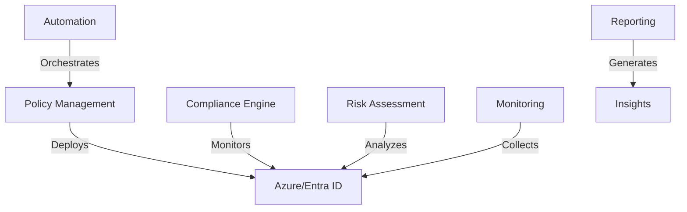

# Azure Conditional Access Automation Framework


[](https://opensource.org/licenses/MIT)
[](https://github.com/PowerShell/PowerShell)
[](https://azure.microsoft.com/services/active-directory/)

Enterprise-grade automation framework for managing Azure/Entra ID Conditional Access policies at scale. Built from real-world experience managing complex security requirements in mid-to-large organizations.

## 🚀 Features

- **Policy Lifecycle Management**
  - Automated policy deployment and updates
  - Conflict detection and resolution
  - Version control and rollback capabilities

- **Compliance & Risk Management**
  - Built-in compliance frameworks (ISO 27001, NIST 800-53, GDPR)
  - Real-time risk assessment
  - Automated compliance reporting

- **Monitoring & Reporting**
  - Advanced policy effectiveness metrics
  - User impact analysis
  - Custom Azure Monitor workbooks

- **Security & Governance**
  - Just-In-Time privileged access
  - Comprehensive audit logging
  - Role-based access control

## 📋 Prerequisites

- PowerShell 7.2 or higher
- Azure/Entra ID Premium P2 license
- Required Azure AD permissions:
  - Policy.ReadWrite.ConditionalAccess
  - Policy.Read.All
  - Directory.Read.All
  - AuditLog.Read.All

## 🛠️ Installation

1. Clone the repository:
```bash
git clone https://github.com/yourusername/ca-automation.git
cd ca-automation
```

2. Install required PowerShell modules:
```powershell
./scripts/setup/install-dependencies.ps1
```

3. Configure your environment:
```powershell
Copy-Item .env.example .env
# Edit .env with your environment settings (ensure .env is in .gitignore)
```

## 🚦 Quick Start

1. **Basic Policy Deployment**
```powershell
Import-Module ./src/modules/policy-management/policy_manager.ps1

$policyManager = [ConditionalAccessPolicyManager]::new($TenantId)
$policyManager.DeployPolicy("./templates/policies/security-baseline.yaml")
```

2. **Compliance Assessment**
```powershell
$complianceManager = [ComplianceManager]::new($TenantId)
$report = $complianceManager.AssessCompliance("ISO27001")
$report.GenerateReport("./reports/compliance-$(Get-Date -Format 'yyyyMMdd').pdf")
```

3. **Risk Analysis**
```powershell
$riskAssessor = [RiskAssessor]::new()
$riskReport = $riskAssessor.AnalyzePolicies()
$riskReport.ExportFindings("./reports/risk-assessment.xlsx")
```

## 📊 Sample Dashboard


The built-in monitoring dashboard provides real-time visibility into:
- Policy effectiveness metrics
- User impact analysis
- Compliance status
- Risk indicators

## 🏗️ Architecture



## 🔒 Security Considerations

- All deployments require approved pull requests
- Changes are validated against security baselines
- Automated conflict detection prevents policy overlap
- Just-In-Time access for privileged operations
- Comprehensive audit logging
- For more details, see [Security Considerations](docs/security/README.md).

## 📖 Documentation

Detailed documentation is available in the [docs](./docs) directory:
- [Architecture Overview](docs/architecture/README.md)
- [Deployment Guide](docs/deployment/README.md)
- [Operation Manual](docs/operations/README.md)
- [Security Considerations](docs/security/README.md)

## 🧪 Testing

Run the test suite:
```powershell
Invoke-Pester ./tests -CI
```

Coverage report will be generated in `./coverage/report.html`

## 🤝 Contributing

1. Fork the repository
2. Create your feature branch (`git checkout -b feature/AmazingFeature`)
3. Commit your changes (`git commit -m 'Add some AmazingFeature'`)
4. Push to the branch (`git push origin feature/AmazingFeature`)
5. Open a Pull Request

See [CONTRIBUTING.md](CONTRIBUTING.md) for detailed guidelines.

## 📜 License

This project is licensed under the MIT License - see the [LICENSE](LICENSE) file for details.

## 🙏 Acknowledgments

- [Microsoft Graph API Documentation](https://docs.microsoft.com/graph/api/resources/conditionalaccesspolicy)
- [Azure/Entra ID Security Best Practices](https://docs.microsoft.com/azure/active-directory/conditional-access/best-practices)
- [PowerShell Team](https://github.com/PowerShell/PowerShell)

## 📊 Project Status

- ✅ Core Policy Management & Foundational Features (see Roadmap for details)
- 🔄 Advanced Analytics & Enhanced "What If" (In Progress)
- 📅 ML-based Recommendations & GUI (Planned)

## 🆘 Support

- For bugs and features, open an issue
- For security issues, see [SECURITY.md](SECURITY.md)
- For questions, join our [Discussions](https://github.com/topazyo/ca-automation/discussions)

## 🗺️ Roadmap

See our [project roadmap](docs/ROADMAP.md) for planned features and enhancements.

---

<p align="center">Made with ❤️ by security engineers for security engineers</p>